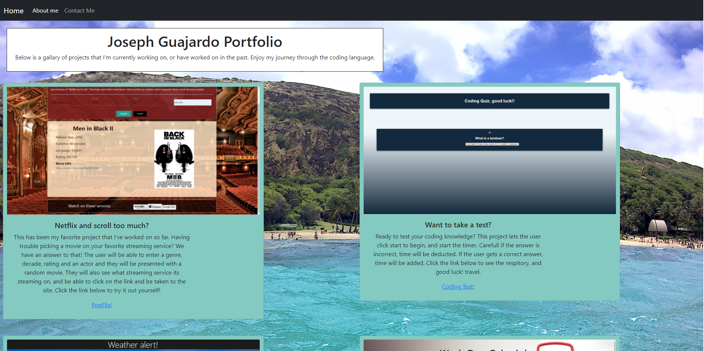

## Welcome to my Portfolio!

  First I would like to welcome you to my portfolio. Take a journey with through the process of learning how to code.

As you navigate my page, you will see my home page. This is where my porfolio is. You will see the projects that I've completed.

There are links to each of the live pages. I've added linkes to my repositories dynamically through fetch so that when I'm working on 

a new project, you will get to see it! 

  At the top, you will see my nav bar, which will take you to Home, About me, and Contact me pages. 

On the about me page, you will see my passion for travel. There are images of me from around the world! 

On the contact page, you will be able to email me with any questions or concerns you may have along with my 

links to my LinkedIn, and GitHub pages. 

## Here is a screen shot of my home page!

## Check out my portfolio!

[https://jagg1991.github.io/](https://jagg1991.github.io/)

## Contact me!

If you have any questions or concerns, please feel free to reach out to me! 
[josephguajardo@ymail.com](josephguajardo@ymail.com)

